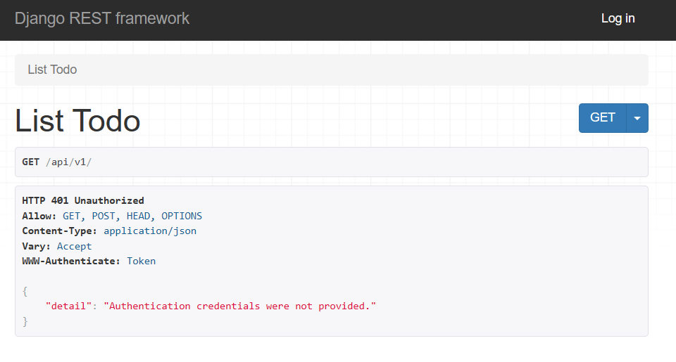
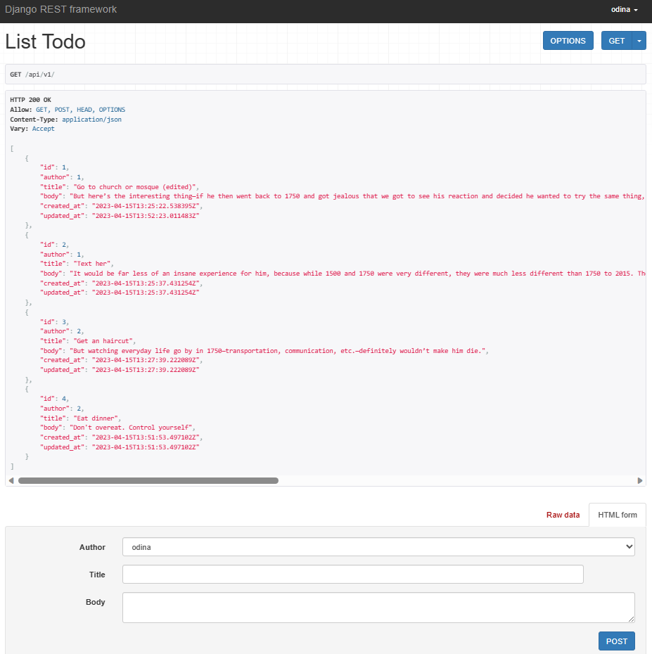
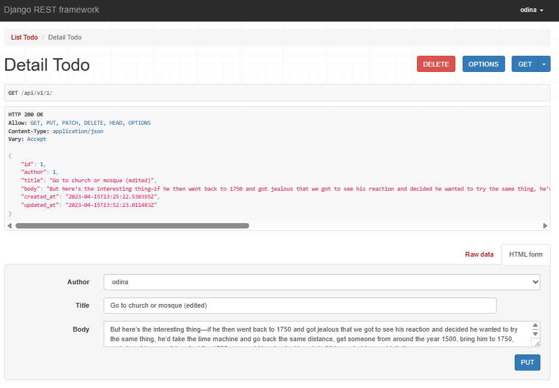
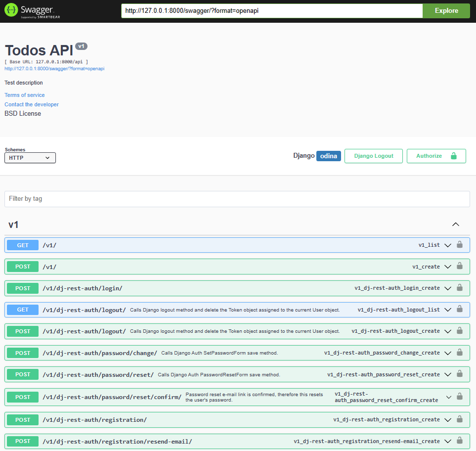

# Todo API with Django REST Framework
Todo Backend with many API endpoints.

## Technologies and functionalies implemented:
1. Django REST Framework
2. Serializers
3. Browable API
4. CORS
5. Permissions (View- and Project-level permissions)
6. User Authentication (Session and Token Authentication)
7. User Registration
8. Schemas and Documentation (Swagger UI)
---
## Api Preview

